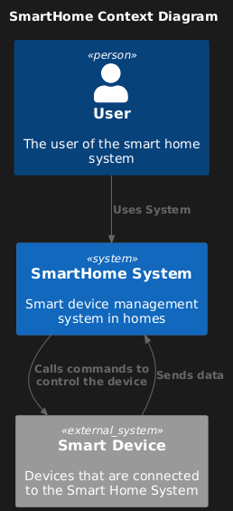
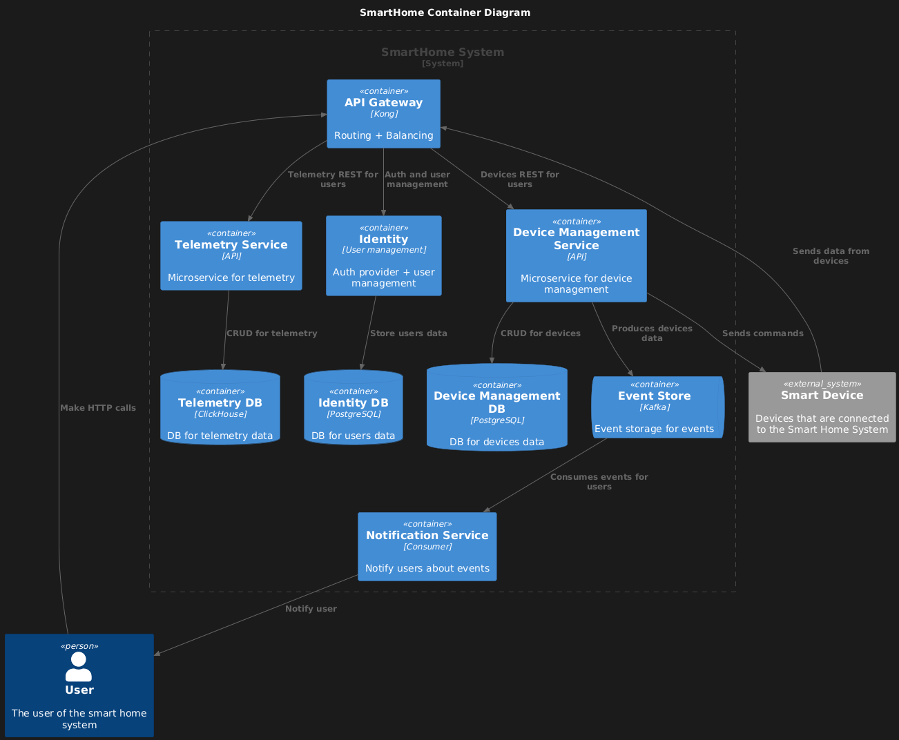
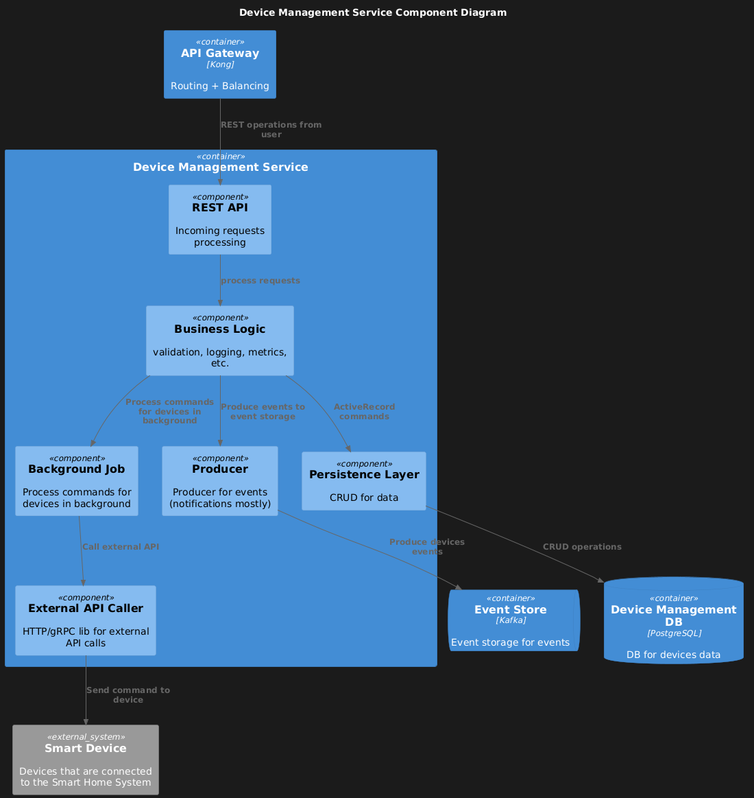
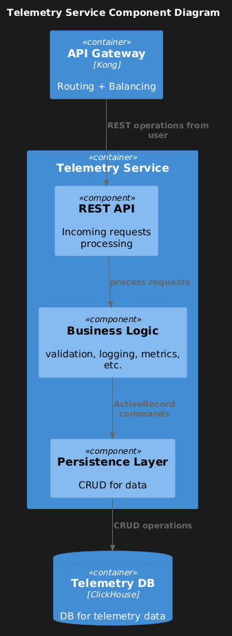
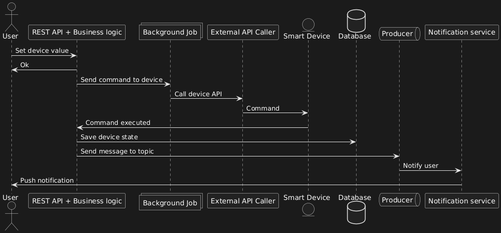
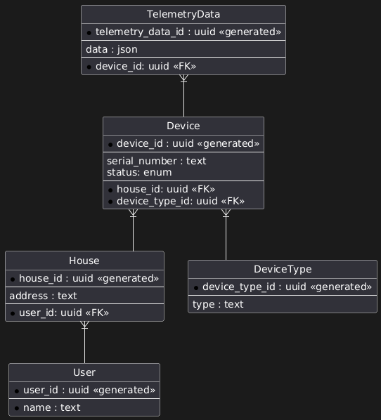

# Задание 1: Анализ и проектирование

## Подзадание 1.1: Анализ и планирование

### Функциональность монолитного приложения

#### 1. Управление отоплением:

- Пользователи могут удалённо включать/выключать отопление в своих домах.
- Пользователи могут устанавливать желаемую температуру.
- Система автоматически поддерживает заданную температуру, регулируя подачу тепла.

#### 2. Мониторинг температуры:

- Система получает данные о температуре с датчиков, установленных в домах.
- Пользователи могут просматривать текущую температуру в своих домах через веб-интерфейс.

### Анализ архитектуры монолитного приложения

- **Язык программирования:** Java
- **База данных:** PostgreSQL
- **Архитектура:** Монолитная, все компоненты системы (обработка запросов, бизнес-логика, работа с данными) находятся в рамках одного приложения.
- **Взаимодействие:** Синхронное, запросы обрабатываются последовательно.
- **Масштабируемость:** Ограничена, так как монолит сложно масштабировать по частям.
- **Развертывание:** Требует остановки всего приложения.

### Домены и границы контекстов

* *Домен: Управление устройствами*
  * поддомен управления состоянием
    * контекст: включение устройства
    * контекст: выключение устройства
    * контекст: обновление состояния устройства
  * поддомен управления температурой
    * контекст: установка целевой температуры
* *Домен: Показатели устройств*
  * поддомен сбора данных с устройств
    * контекст: отображение текущей температуры
    * контекст: отображение текущего состояния устройства

### Визуализация контекста системы

[Context Diagram plantuml](./diagrams/context/SmartHome_context.puml)



## Подзадание 1.2: Архитектура микросервисов

### C4 — Уровень контейнеров (Containers)

[Containers Diagram plantuml](./diagrams/containers/SmartHome_containers.puml)



### C4 — Уровень компонентов (Components)

#### Device Management Service

[Device Management components diagram plantuml](./diagrams/components/DeviceManagement_components.puml)



#### Telemetry Service

[Telemetry components diagram plantuml](./diagrams/components/Telemetry_components.puml)



### C4 — Уровень кода (Code)

[Device Management code diagram plantuml](./diagrams/code/DeviceManagement_device_set_code.puml)



## Подзадание 1.3: ER-диаграмма

[ERD diagram plantuml](./diagrams/erd/SmartHome_erd.puml)



## Подзадание 1.4: Создание и документирование API

[Swagger](./openapi/swagger.yaml)

# Задание 2: Разработка MVP

## Подзадание 2.1: Новые микросервисы и интеграция с монолитом

В корне репозитория добавлены 2 проекта:
- telemetry_service
- device_management

Для запуска микросервисов необходимо выполнить:

```bash
docker compose up -d
```

После того, как поднимуться микросервисы и kong gateway, необходимо добавить маршруты в конфигурацию kong-а:

### Для микросервиса управления устройствами

``` bash
curl -i -X POST http://localhost:8001/services/ \
--data "name=device-management" \
--data "url=http://device-management:8000"
```

``` bash
curl -i -X POST http://localhost:8001/services/device-management/routes \
--data "paths[]=/device-management"
```

### Для микросервиса телемаетрии

``` bash
curl -i -X POST http://localhost:8001/services/ \
--data "name=telemetry" \
--data "url=http://telemetry:8000"
```

``` bash
curl -i -X POST http://localhost:8001/services/telemetry/routes \
--data "paths[]=/telemetry"
```

после этого станут доступны эндпоинты микросервисов

Например, можно добавить новое устройство:

``` bash
curl --header "Content-Type: application/json" \
--request POST \
--data '{"serial_number":"SN123AABB","status":"hibernate"}' \
http://localhost:8000/device-management/devices
```

в результате должен появиться вывод в консоли:

``` bash
{"status":"success","message":"Device successfuly created"}
```

Теперь можно проверить в браузере, что устройство появилось в базе, пройдя по ссылке: `http://localhost:8000/device-management/devices`, получим текущий список устройста в БД

Выбрав, произвольный UUID из списка, можно проверить, что по URL `http://localhost:8000/device-management/devices/<UUID>` бэкенд отдает информацию по устройству

Так же можно отправить на устройство какую-нибудь комманду:

``` bash
curl --header "Content-Type: application/json" \
--request POST \
--data '{"lights":"off"}' \
http://localhost:8000/device-management/devices/<UUID>/commands
```

В логе контейнера `architecture-sprint-3-device-management-1` появятся сообщения вида:

``` bash
Sending task to background jobs
Requesting device
Producing message to topic
```

Подобным образом можно проверить работу сервиса телеметрии:

Добавим в БД несколько новых записей телеметрии устройства:
``` bash
curl --header "Content-Type: application/json" \
--request POST \
--data '{"temperature":"55","status":"hibernating"}' \
http://localhost:8000/telemetry/devices/<UUID>/telemetry
```

``` bash
curl --header "Content-Type: application/json" \
--request POST \
--data '{"connection":"active","status":"sleep"}' \
http://localhost:8000/telemetry/devices/<UUID>/telemetry
```

После чего в браузере по адресу `http://localhost:8000/telemetry/devices/<UUID>/telemetry` получим список показателей

Или по адресу `http://localhost:8000/telemetry/devices/<UUID>/telemetry/latest` последние добавленные показания
